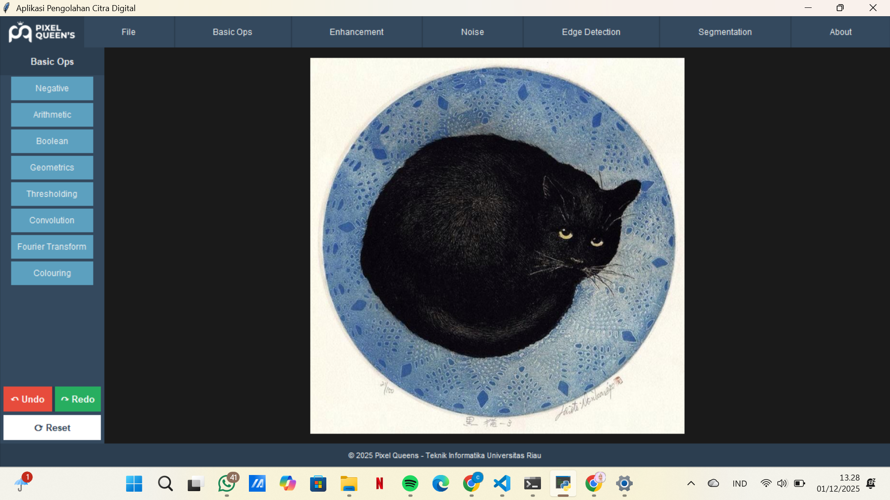

# PIXEL QUEENS | Aplikasi Pengolahan Citra Digital


Pixel Queens adalah aplikasi pemrosesan citra digital berbasis GUI yang dikembangkan menggunakan Python dan Tkinter.  
Aplikasi ini menyediakan berbagai fitur manipulasi citra, mulai dari operasi dasar, enhancement, penambahan noise, deteksi tepi, hingga segmentasi dan watermark.

Tampilan utama aplikasi (opsional):



---

## Fitur Utama

Semua fitur diakses melalui menu bar bagian atas:

- File  
- Basic Ops  
- Enhancement  
- Noise  
- Edge Detection  
- Segmentation  
- About

---

## 1. File

Fitur yang tersedia:

- Open: Membuka file gambar (jpg, png, bmp).  
- Save: Menyimpan hasil pengolahan ke folder Downloads.  
- Save As: Menyimpan gambar baru dengan nama berbeda.  
- Exit: Keluar dari aplikasi.

Fitur pendukung:

- Undo dan Redo.  
- Reset untuk mengembalikan citra ke kondisi awal.

---

## 2. Basic Ops

Berisi operasi dasar pengolahan citra.

### Negative  
Mengubah citra menjadi negatif.

### Arithmetic  
Operasi aritmatika:  
- Add  
- Subtract  
- Multiply  
- Divide  

### Boolean  
Operasi logika antar dua gambar:  
- NOT  
- AND  
- OR  
- XOR

### Geometrics  
Operasi geometri pada citra:  
- Translation  
- Rotation  
- Zoom In / Zoom Out  
- Flip  
- Crop  

### Thresholding  
Mengubah citra menjadi biner berdasarkan nilai threshold input dari user.  
Terdapat juga mode binary fixed (threshold 128).

### Convolution  
Operasi menggunakan kernel konvolusi:  
- Blur  
- Sharpen  
- Edge Detect  

Terdapat slider untuk mengatur intensitas.

### Fourier Transform  
Menampilkan bentuk citra dalam domain frekuensi.

### Colouring  
Konversi warna berbagai model:  
- Binary  
- Grayscale  
- RGB (menampilkan 3 channel terpisah)  
- HSV  
- CMY  
- YUV  
- YIQ  
- Pseudo Color  

---

## 3. Enhancement

Fitur perbaikan kualitas citra.

### Brightness  
Mengatur tingkat kecerahan menggunakan slider.

### Contrast  
Mengatur kontras menggunakan slider.

### Histogram Equalization  
Menghasilkan kontras otomatis dengan pemerataan histogram.

### Smoothing  
Terdiri dari dua kategori:

#### Spatial Domain  
- Lowpass Filtering  
- Median Filtering  

#### Frequency Domain  
- ILPF  
- BLPF  

### Sharpening  

#### Spatial Domain  
- Highpass Filtering  
- Highboost Filtering  

#### Frequency Domain  
- IHPF  
- BHPF  

### Geometric Correction  
Melakukan koreksi geometrik pada citra.

---

## 4. Noise

Menyisipkan berbagai jenis noise ke dalam citra:

- Gaussian  
- Rayleigh  
- Erlang  
- Exponential  
- Uniform  
- Impulse Noise (Salt and Pepper)

Semua proses noise berjalan menggunakan threading agar antarmuka tidak lag.

---

## 5. Edge Detection

Deteksi tepi menggunakan beberapa metode.

### 1st Gradient
- Sobel  
- Prewitt  
- Roberts  

### 2nd Gradient
- Laplacian  
- LoG (Laplacian of Gaussian)  
- Canny  

### Compass
Deteksi tepi menggunakan metode compass (misalnya Kirsch) pada versi citra yang sudah di-resize untuk efisiensi.

---

## 6. Segmentation dan Watermark

Fitur segmentasi citra.

- Contour: Deteksi kontur citra.  
- Watershed: Segmentasi objek menggunakan metode watershed.  
- Watermark: Menambahkan teks watermark ke dalam citra sesuai input pengguna.

---

## Tampilan dan Pengalaman Pengguna

- Menggunakan tema gelap dengan warna dasar:  
  - #1a1a1a  
  - #2C3E50  
  - #34495E  
- Tersedia submenu dan tombol: Undo, Redo, Reset.  
- Popup peringatan tampil dengan animasi fade-in.  
- Footer aplikasi berisi informasi:  
  "© 2025 Pixel Queens - Teknik Informatika Universitas Riau"

Logo Pixel Queens ditampilkan pada bagian kiri atas aplikasi.

---

## Teknologi yang Digunakan

- Python 
- Tkinter  
- Pillow  
- NumPy  

Modul internal:  

- basic_ops.py  
- enhancement.py  
- noise.py  
- edge_detection.py  
- segmentation.py  

---

## Cara Instalasi dan Menjalankan

1. Clone repository:
    ```bash
    git clone https://github.com/Putrianisa2526/image-processing-gui-tkinter.git
    cd image-processing-gui-tkinter

2.  **Install Library yang Dibutuhkan:**
    Pastikan kamu sudah menginstall Python, lalu jalankan perintah berikut di terminal:
    ```bash
    pip install customtkinter opencv-python numpy pillow
    ```

3.  **Jalankan Aplikasi:**
    ```bash
    python main.py
    ```

## Tim Pengembang (Pixel Queen's)

Proyek ini dikembangkan oleh tim mahasiswa:

* **Marita Habibah (2307127049)**
* **Putri Anisa (2307110348)** - [GitHub](https://github.com/Putrianisa2526)

Program Studi Teknik Informatika, Universitas Riau.

## Tutorial & Demo

Untuk melihat Tutorial dan demo aplikasi, silakan kunjungi:
* [Channel YouTube Putri Anisa](https://www.youtube.com/@putrianisa3684)

## Lisensi

Proyek ini dibuat untuk memenuhi tugas besar praktikum mata kuliah Pengolahan Citra Digital.

---
*Dibuat dengan ❤️ oleh Pixel Queen's.*
